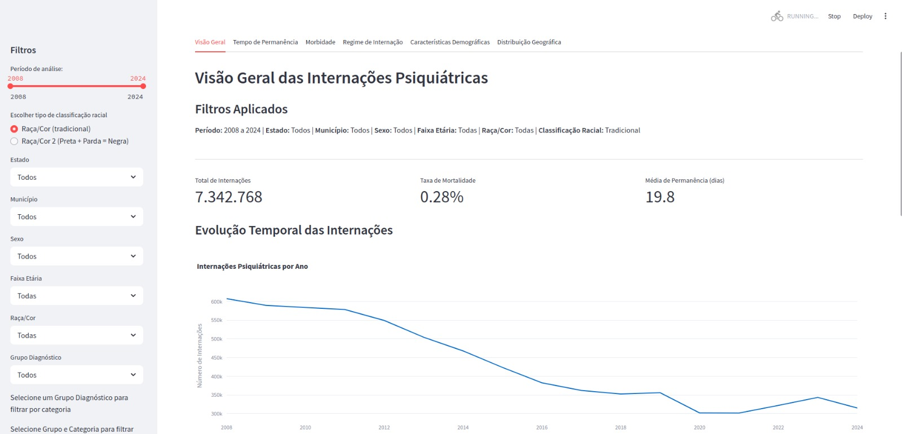

# Dataset de Saúde Coletiva

Este dataset contém informações sobre saúde pública no Brasil, incluindo dados de mortalidade, internações hospitalares e indicadores de saúde.

## Conteúdo do Dataset

O dataset contém os seguintes arquivos:

1. `sih_2000_2024.csv` - Sistema de Informações Hospitalares (SIH) contendo dados de internações hospitalares de 2000 a 2024
2. `sim_limpo_e_alterado.csv` - Sistema de Informações sobre Mortalidade (SIM) processado
3. `sim_95_columns_versao_final.csv` - Versão final do SIM com 95 colunas
4. `populacao.db` - Banco de dados com informações populacionais
5. `cir_municipios.csv` - Dados dos municípios brasileiros
6. `base_magda.xlsx` - Base de dados complementar
7. `Base_de_Dados_IDSC-BR_2022.xlsx`, `Base_de_Dados_IDSC-BR_2023.xlsx`, `Base_de_Dados_IDSC-BR_2024.xlsx` - Indicadores de Desenvolvimento Sustentável das Cidades - Brasil
8. `RELATORIO_DTB_BRASIL_MUNICIPIO.xls` - Divisão Territorial Brasileira

## Estrutura dos Dados

### SIH (Sistema de Informações Hospitalares)
- Período: 2000-2024
- Principais variáveis:
  - Dados demográficos (idade, sexo, raça/cor)
  - Informações de internação (data, procedimentos, diagnósticos)
  - Dados financeiros (valores totais, valores por serviço)
  - Informações de UTI
  - Dados geográficos (município de residência, coordenadas)

### SIM (Sistema de Informações sobre Mortalidade)
- Principais variáveis:
  - Causas de óbito
  - Dados demográficos
  - Local de ocorrência
  - Características do óbito

## Fonte dos Dados

Os dados são provenientes de sistemas oficiais do Ministério da Saúde do Brasil:
- Sistema de Informações Hospitalares (SIH)
- Sistema de Informações sobre Mortalidade (SIM)
- Indicadores de Desenvolvimento Sustentável das Cidades - Brasil (IDSC-BR)

## Uso Pretendido

Este dataset pode ser utilizado para:
- Análises epidemiológicas
- Estudos de saúde pública
- Pesquisas em políticas de saúde
- Desenvolvimento de indicadores de saúde
- Análises espaciais de saúde

## Limitações

- Os dados estão sujeitos às limitações dos sistemas de informação em saúde
- Alguns registros podem conter informações incompletas
- As variáveis podem ter diferentes níveis de completude ao longo do tempo

## Citação

Se você utilizar este dataset em sua pesquisa, por favor cite:

```
@dataset{saude_coletiva_2024,
  author = {Felipe Rafael},
  title = {Dataset de Saúde Coletiva},
  year = {2024},
  publisher = {HuggingFace},
  url = {https://huggingface.co/datasets/feliperafael/saude-coletiva}
}
```

## Licença

Este dataset está licenciado sob a licença Creative Commons Attribution 4.0 International (CC BY 4.0).

# Atlas Nacional de Saúde Mental

Este projeto consiste em um conjunto de painéis interativos desenvolvidos em Streamlit para análise e visualização de dados relacionados à saúde mental no Brasil. O objetivo é criar um atlas nacional que permita a análise das morbidades de internações psiquiátricas, taxas de mortalidade e outros indicadores relevantes, organizados por sexo, idade e cor/raça.

## Obtendo os Dados

Os dados utilizados neste projeto estão disponíveis no Hugging Face. Para baixar e utilizar os dados, siga os passos abaixo:

1. Instale as dependências necessárias:
```bash
pip install huggingface-hub python-dotenv
```

2. Crie um arquivo `.env` na raiz do projeto com suas credenciais do Hugging Face:
```
HF_USERNAME=seu_usuario
HF_TOKEN=seu_token
```

3. Execute o script de download:
```bash
python scripts/hf_data_manager.py --repo-id "feliperafael/saude-coletiva" --action download
```

Os arquivos serão baixados para a pasta `data/` do projeto.

## Estrutura do Projeto

O projeto é composto por vários painéis interativos, cada um focado em um aspecto específico da análise de saúde mental:

1. **Indicadores de Saúde Mental** (`indicadores_saude_mental.py`)
   - Análise dos indicadores iCAPS e iRAPS
   - Visualização de correlações entre indicadores
   - Distribuição geográfica dos indicadores

2. **Morbidade de Internações** (`morbidade_internacoes.py`)
   - Análise detalhada das causas de internação
   - Distribuição por faixa etária
   - Análise por sexo e raça/cor

3. **Taxa de Mortalidade** (`app_taxa_mortalidade.py`)
   - Análise das taxas de mortalidade
   - Comparação entre diferentes grupos populacionais
   - Evolução temporal

4. **Análise iCAPS** (`icaps_analysis.py`)
   - Foco específico no indicador iCAPS
   - Correlações com outros indicadores
   - Distribuição geográfica

5. **Análise iRAPS** (`iraps_analysis.py`)
   - Foco específico no indicador iRAPS
   - Análise de tendências
   - Comparação com outros indicadores

6. **Grupo CIR** (`grupo_cir.py` e `grupo_cir_with_taxa.py`)
   - Análise por grupos CIR
   - Correlação com taxas de mortalidade
   - Distribuição geográfica

7. **Relação IDSC** (`relacao_idsc.py`)
   - Análise da relação com o IDSC
   - Correlações e tendências
   - Visualizações específicas

## Requisitos

Para executar o projeto, você precisará ter instalado:

- Python 3.8 ou superior
- pip (gerenciador de pacotes Python)
- Docker (opcional, para ambiente isolado)

## Instalação

1. Clone o repositório:
```bash
git clone https://github.com/feliperafael/saude-coletiva-painel.git
cd saude-coletiva-painel
```

2. Instale as dependências:
```bash
pip install -r requirements.txt
```

3. Certifique-se de que os arquivos de dados necessários estão na pasta `data/`:
   - `base_magda.xlsx`
   - `sim_limpo_e_alterado.csv`
   - `populacao.db`

## Como Executar

### Opção 1: Execução Local

Cada painel pode ser executado individualmente usando o comando:

```bash
streamlit run [NOME_DO_ARQUIVO].py
```

Por exemplo, para executar o painel de Indicadores de Saúde Mental:

```bash
streamlit run indicadores_saude_mental.py
```

### Opção 2: Execução com Docker

1. Construa a imagem:
```bash
docker compose build
```

2. Execute o container:
```bash
docker compose up
```

## Estrutura de Dados

O projeto utiliza várias fontes de dados:

1. **Dados de Internação** (`sim_limpo_e_alterado.csv`)
   - Informações sobre internações psiquiátricas
   - Dados demográficos dos pacientes
   - Diagnósticos e procedimentos

2. **Base Magda** (`base_magda.xlsx`)
   - Indicadores iCAPS e iRAPS
   - Informações municipais
   - Classificação CIR

3. **Banco de Dados de População** (`populacao.db`)
   - Dados populacionais
   - Projeções e estimativas
   - Informações demográficas

## Visualizações

O projeto inclui várias visualizações interativas:

1. **Gráficos de Distribuição**
   - Histogramas
   - Box plots
   - Gráficos de densidade

2. **Visualizações Geográficas**
   - Mapas de calor
   - Distribuição por município
   - Agrupamentos regionais

3. **Análises Temporais**
   - Séries temporais
   - Tendências
   - Evolução dos indicadores

4. **Correlações**
   - Matrizes de correlação
   - Gráficos de dispersão
   - Análises de regressão

### Exemplos de Visualizações

#### 1. Análise de Morbidade

*Distribuição de internações por faixa etária*


*Distribuição de internações por sexo*


*Distribuição de internações por raça/cor*

#### 2. Taxa de Mortalidade

*Evolução temporal da taxa de mortalidade*

#### 3. Relação IDSC

*Análise de correlação entre indicadores*


*Análise detalhada de correlações*

#### 4. Análise Detalhada

*Distribuição geográfica das internações*


*Análise temporal das internações*

## Segurança

1. **Credenciais e Tokens**
   - Nunca comite credenciais ou tokens no código
   - Utilize variáveis de ambiente para armazenar informações sensíveis
   - Para tokens do Hugging Face, utilize o arquivo `.env` ou variáveis de ambiente do sistema

2. **Dados Sensíveis**
   - Os dados de saúde são sensíveis e devem ser tratados com cuidado
   - Siga as diretrizes da LGPD para o tratamento de dados pessoais
   - Mantenha os dados anonimizados quando possível

3. **Ambiente de Desenvolvimento**
   - Utilize ambientes virtuais para isolar as dependências
   - Mantenha as dependências atualizadas
   - Siga as boas práticas de segurança do Python

## Contribuições

Contribuições são bem-vindas! Para contribuir:

1. Faça um fork do projeto
2. Crie uma branch para sua feature (`git checkout -b feature/AmazingFeature`)
3. Commit suas mudanças (`git commit -m 'Add some AmazingFeature'`)
4. Push para a branch (`git push origin feature/AmazingFeature`)
5. Abra um Pull Request

## Licença

Este projeto está licenciado sob a licença MIT - veja o arquivo LICENSE para detalhes.

